<!-- Local Animated SVG Banner -->

  

<!-- Featured Live Portfolio Link -->

  

<!-- Social Badges -->

&nbsp;

&nbsp;

  

<!-- Robot Hammer Animation -->

  

 

## :technologist: About Me

* :mortar_board: **Mechatronics Engineering Student** @ Mangalore Institute of Technology & Engineering (MITE).
* :robot: Exploring **Artificial Intelligence, Machine Learning & Intelligent Robotics**.
* :racing_car: Passionate about **Automotive Powertrains, Vehicle Dynamics & Acoustics**.
* :hammer_and_wrench: Building at the intersection of **Mechanical Design, Embedded C/C++, and Modern Web Applications**.

> *"I combine engineering hardware logic with modern software systems to build functional, real-world tools."*

 

  

 

## :globe_with_meridians: Live Web Applications (Hosted on Vercel)

| Application | Live Production URL | Source Code | Key Tech |
| :--- | :--- | :--- | :--- |
| :wrench: **MechMate** |  |  | React 19 &bull; Gemini AI &bull; Vite |
| :racing_car: **REV // THE BEAST** |  |  | React 18 &bull; Web Audio API &bull; Vite |
| :house: **HomeGuard** |  |  | React &bull; IoT Sensors &bull; Gemini AI |

 

  

 

## :rocket: Projects & Repositories

* **[MechMate](https://github.com/shubhamkerure07/mechmate)** — AI automotive diagnostic assistant powered by Google Gemini AI with localized repair triage. • [Live Demo](https://mechmate-sigma.vercel.app) | [GitHub](https://github.com/shubhamkerure07/mechmate)
* **[REV-THE-BEAST](https://github.com/shubhamkerure07/REV-THE-BEAST-)** — Interactive automotive web platform exploring high-displacement engine acoustics & powertrain specs. • [Live Demo](https://rev-the-beast.vercel.app/) | [GitHub](https://github.com/shubhamkerure07/REV-THE-BEAST-)
* **[HomeGuard](https://github.com/shubhamkerure07/HomeGuard)** — Modern smart home security & intrusion defense platform with 2D architectural floor plan & AI copilot. • [Live Demo](https://homeguard-app.vercel.app/) | [GitHub](https://github.com/shubhamkerure07/HomeGuard)
* **[Engineering Portfolio](https://github.com/shubhamkerure07/portfolio)** — Personal engineering & mechatronics portfolio with interactive Web Audio tactile dynamics. • [Live App](https://portfolio-lac-two-76.vercel.app/) | [GitHub](https://github.com/shubhamkerure07/portfolio)
* **[Neon Dash](https://github.com/shubhamkerure07/neon-dash)** — Fast-paced 2D cyberpunk endless runner with procedural canvas physics & autonomous AI bot. • [GitHub](https://github.com/shubhamkerure07/neon-dash)
* **[EduClass (Edu Made Easy)](https://github.com/shubhamkerure07/edu-made-easy)** — Native Android online tuition & classroom platform with live sessions, quizzes, and 1-on-1 mentorship. • [GitHub](https://github.com/shubhamkerure07/edu-made-easy)
* **[StudentHub](https://github.com/shubhamkerure07/student-manager)** — Native Android academic planner with auto-alarms, attendance tracking, and Canvas spending graphs. • [GitHub](https://github.com/shubhamkerure07/student-manager)
* **[MITE Contineo Enhanced](https://github.com/shubhamkerure07/mite-contineo-webs-enhanced-version)** — Modernized college academic portal redesign with attendance margin calculators & Gemini AI. • [GitHub](https://github.com/shubhamkerure07/mite-contineo-webs-enhanced-version)

 

  

 

## :tools: Engineering Disciplines & Tech Stack

| Domain | Technologies & Frameworks |
| :--- | :--- |
| **Languages** | `C` `C++` `Python` `TypeScript` `JavaScript` `Kotlin` |
| **Web & UI Frameworks** | `React` `Vite` `Tailwind CSS` `HTML5` `CSS3` `Web Audio API` |
| **Mobile Development** | `Android SDK` `Jetpack Compose` `Kotlin Coroutines` |
| **AI & APIs** | `Google Gemini API` `RESTful APIs` `Prompt Engineering` |
| **Mechatronics & Embedded** | `Arduino` `Raspberry Pi` `Circuit Simulation (SPICE)` `Actuators & Sensors` `PID Control` |
| **Dev Tools** | `Git` `GitHub` `VS Code` `Vercel` `Linux CLI` |

 

  

 

## :sparkles: Thank You!

### Thanks for visiting my GitHub profile! :rocket:

*Whether you're exploring my projects, interested in mechatronics engineering, or want to collaborate on software & hardware systems — I'd love to connect!*

 

&nbsp;&nbsp;

  

**:zap: Engineering the future with code and hardware.**

