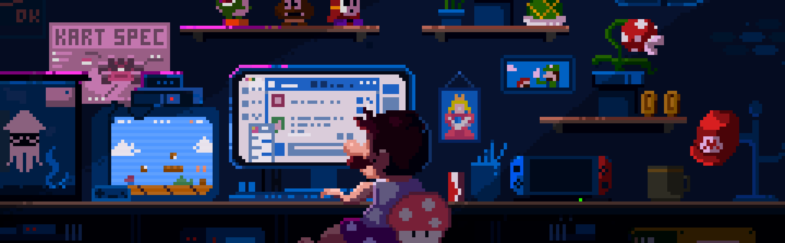

<!-- Animated Header Wave Banner -->

<!-- Dynamic Animated Typing SVG -->

  

<!-- Featured Live Portfolio Link Button -->

  

<!-- Social Badges & Views Counter -->

&nbsp;

&nbsp;

&nbsp;

  

 

## 👨‍💻 Aesthetic Code Space // Gen-Z Vibe

  

> *"Writing clean code with good energy — from low-level C memory pointers to modern AI web apps and responsive user interfaces."*

 

  

 

## 🤖 Mechatronics & Hardware Forge

  

> *"When hardware doesn't calibrate on the first try... 🔨🤖"*  
> **Engineering at the intersection of circuits, sensor fusion, closed-loop PID control, and embedded microcontrollers.**

 

  

 

## 🚀 Projects & Systems (4-Line Summaries)

### 🔧 1. [MechMate — AI Automotive Diagnostic Assistant](https://github.com/shubhamkerure07/mechmate)
* **What it does**: Intelligent automotive diagnostic assistant powered by Google Gemini AI to triage vehicle symptoms.
* **Key Capabilities**: Natural language symptom breakdown, safety hazard classification, and localized ₹ INR repair estimation.
* **Tech Stack**: React 19, TypeScript, Google Gemini API, Vite, Tailwind CSS.
* **Links**: [🌐 Live Web App](https://mechmate-sigma.vercel.app) • [💻 GitHub Source](https://github.com/shubhamkerure07/mechmate)

---

### 🔊 2. [REV-THE-BEAST — Automotive Acoustics & Telemetry](https://github.com/shubhamkerure07/REV-THE-BEAST-)
* **What it does**: Interactive automotive sensory web platform exploring high-displacement engine acoustics and mechanical specs.
* **Key Capabilities**: Real-time synthesized engine audio (V8, V10, Turbo-4) and mechanical powertrain telemetry inspection.
* **Tech Stack**: React, TypeScript, Web Audio API, Vite, Tailwind CSS.
* **Links**: [💻 GitHub Source](https://github.com/shubhamkerure07/REV-THE-BEAST-)

---

### 🏃‍♂️ 3. [Neon Dash — Cyberpunk Endless Runner & AI Bot](https://github.com/shubhamkerure07/neon-dash)
* **What it does**: Fast-paced 2D cyberpunk endless runner built with procedural canvas physics and an autonomous bot.
* **Key Capabilities**: Real-time obstacle detection AI bot for hands-free play, parallax neon cityscape, and procedural Web Audio.
* **Tech Stack**: Vanilla JavaScript, HTML5 Canvas, Web Audio API, CSS3.
* **Links**: [💻 GitHub Source](https://github.com/shubhamkerure07/neon-dash)

---

### 📱 4. [Student Manager — Native Android App](https://github.com/shubhamkerure07/student-manager)
* **What it does**: Native Android utility for student academic record keeping, timetable tracking, and GPA calculations.
* **Key Capabilities**: Declarative Material Design 3 interface with persistent local database storage for courses and attendance.
* **Tech Stack**: Kotlin, Jetpack Compose, Android SDK, Kotlin Coroutines.
* **Links**: [💻 GitHub Source](https://github.com/shubhamkerure07/student-manager)

---

### 🎓 5. [MITE Contineo Enhanced — Student Academic Portal](https://github.com/shubhamkerure07/mite-contineo-webs-enhanced-version)
* **What it does**: Modernized, streamlined redesign of the college academic portal eliminating interface friction.
* **Key Capabilities**: Intuitive mobile-first student dashboard with rapid timetable access and student academic utilities.
* **Tech Stack**: TypeScript, React, Modern CSS, REST APIs.
* **Links**: [💻 GitHub Source](https://github.com/shubhamkerure07/mite-contineo-webs-enhanced-version)

---

### 🤖 6. [Autonomous Line Following Robot](https://github.com/shubhamkerure07)
* **What it does**: Autonomous differential-drive mechatronic vehicle engineered for closed-loop trajectory tracking.
* **Key Capabilities**: 5-channel analog IR reflection array, closed-loop PID motor differential control, and ultrasonic obstacle avoidance.
* **Tech Stack**: Arduino, Embedded C/C++, Sensors, Motor Drivers, Hardware.
* **Links**: [💻 GitHub Profile](https://github.com/shubhamkerure07)

---

### ⚡ 7. [Data Structures & Systems in C](https://github.com/shubhamkerure07)
* **What it does**: Low-level systems programming in C exploring memory architectures and algorithmic efficiency.
* **Key Capabilities**: Pointer arithmetic, manual dynamic heap memory allocation, custom linked lists, and binary search trees.
* **Tech Stack**: C, GCC Compiler, Memory Management, Algorithms (DSA).
* **Links**: [💻 GitHub Profile](https://github.com/shubhamkerure07)

 

  

 

## 🛠️ Engineering Disciplines & Tech Stack

| Domain | Technologies & Frameworks |
| :--- | :--- |
| **Languages** | `C` `C++` `Python` `TypeScript` `JavaScript` `Kotlin` |
| **Web & UI Frameworks** | `React` `Vite` `Tailwind CSS` `HTML5` `CSS3` `Web Audio API` |
| **Mobile Development** | `Android SDK` `Jetpack Compose` `Kotlin Coroutines` |
| **AI & APIs** | `Google Gemini API` `RESTful APIs` `Prompt Engineering` |
| **Mechatronics & Embedded** | `Arduino` `Raspberry Pi` `Circuit Simulation (SPICE)` `Actuators & Sensors` `PID Control` |
| **Dev Tools** | `Git` `GitHub` `VS Code` `Vercel` `Linux CLI` |

 

  

 

## 📈 GitHub Activity & Analytics

  

 

  

 

## 🙏 Thank You!

### Thanks for visiting my GitHub profile! 🚀
*Whether you're exploring my projects, interested in mechatronics engineering, or want to collaborate on software & hardware systems — I'd love to connect!*

 

&nbsp;&nbsp;

  

**⚡ Engineering the future with code and hardware.**

 

<!-- Animated Waving Footer Capsule -->

